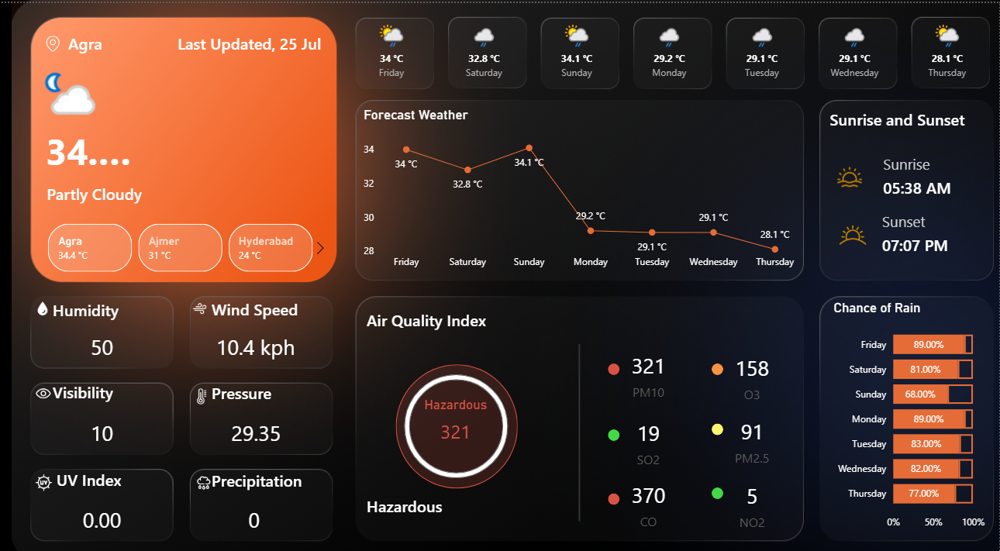

# 🌦️ Power BI Weather Dashboard

A Power BI dashboard displaying weather data using clean visualizations, filters, and maps.

---

## 📸 Screenshot

---

## 🎥 Demo Video

Click below to watch the screen recording demo:  
[▶️ Watch demo (MP4)](./demo.mp4)

---

## 📁 Download Project

You can download and open the full Power BI file:  
👉 [WeatherDashboard.pbix](./WeatherDashboard.pbix)

---

## 📊 Features

- Weather visualizations: Temperature, humidity, etc.
- Interactive filters
- Clean layout with modern UI

